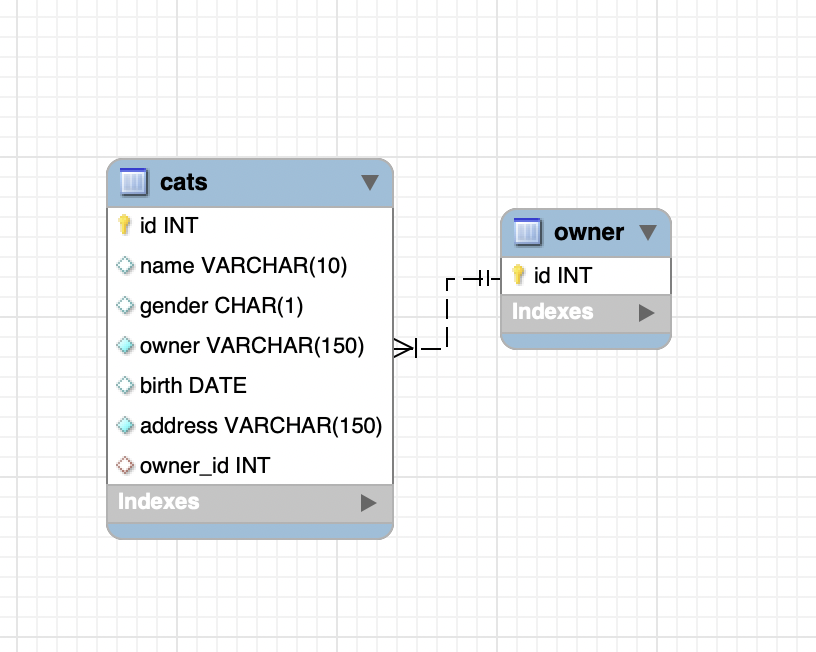
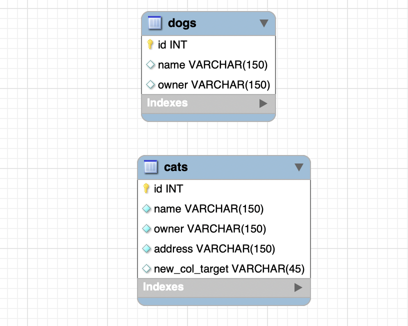

# MySQLMergeTool

## Usage
The MySQL Merge Tool is designed to compare two databases and generate an SQL file containing SQL commands to modify
definitions of tables in the target database. The purpose of this tool is to improve data integrity and efficiency by 
updating tables in target database instead of recreating them using "DROP TABLE IF EXISTS x; CREATE TABLE x" command.
The tool aims to increase flexibility and avoid hardcoded passwords by adopting a command line approach


## Instructions
### To install requirements
```
pip install -r requirements.txt
```

### Command line
```
python merge_sql_generator.py dump ...
```

or
```
python merge_sql_generator.py conn ...
```

Adjust the command to use the specific Python interpreter version (python3, etc.)

#### 1) To merge databases (source -> target) using mysql dump files
Specify paths to source and target mysql dump files after `dump` 
using the following flags:

* `-s` source mysql dump file path
* `-t` target mysql dump file path

#### 2) To merge connected databases (source -> target)
Specify configurations of source and target databases after `conn` 
using the following flags:

* `-sh` source hostname 
* `-su` source username 
* `-sp` source password 
* `-sd` source sub-database
* `-th` target hostname 
* `-tu` target username 
* `-tp` target password 
* `-td` target sub-database

### Output
Based on the differences found during the comparison between the two databases, an SQL file named `merge_sql.sql` 
containing the necessary SQL commands to modify the target database will be generated under the root directory. 
The SQL file includes statements to add, modify, or drop tables, columns, constraints in the target database as 
necessary. The SQL file does not contain or update records.

## Examples
Source and target databases:




#### 1) Merge by comparing given dump files
- Input: [source](Examples/source_db.sql) and [target](Examples/target_db.sql) dump files
- Command:
  ```
  python merge_sql_generator.py dump -s Examples/source_db.sql -t Examples/target_db.sql
  ```

#### 2) Merge by connecting 
- Input: None
- Command: 
  ```
  python merge_sql_generator.py conn -sh localhost -su root -sp "" -sd source -th localhost -tu root -tp "" -td target
  ```

#### Output: [merge_sql.sql](Examples/merge_sql.sql)

## Limitations
- The tool's ability to generate accurate modification statements for complex table **constraints** may be limited. It is 
recommended to review the constraint modification statements as needed
- The tool supports MySQL databases only as it was developed based on MySQL commands
- The tool is designed to handle updates to definitions of tables and columns, and does not support other database
objects such as views, stored procedures, functions, etc.